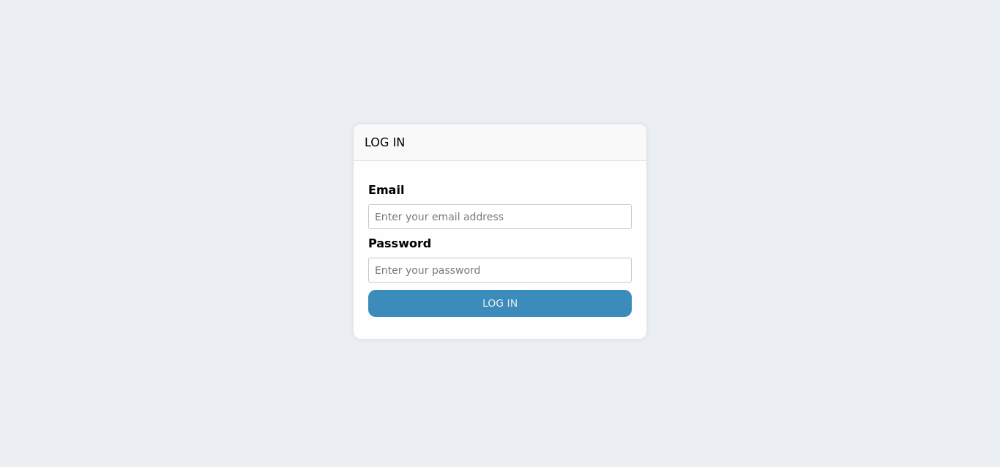
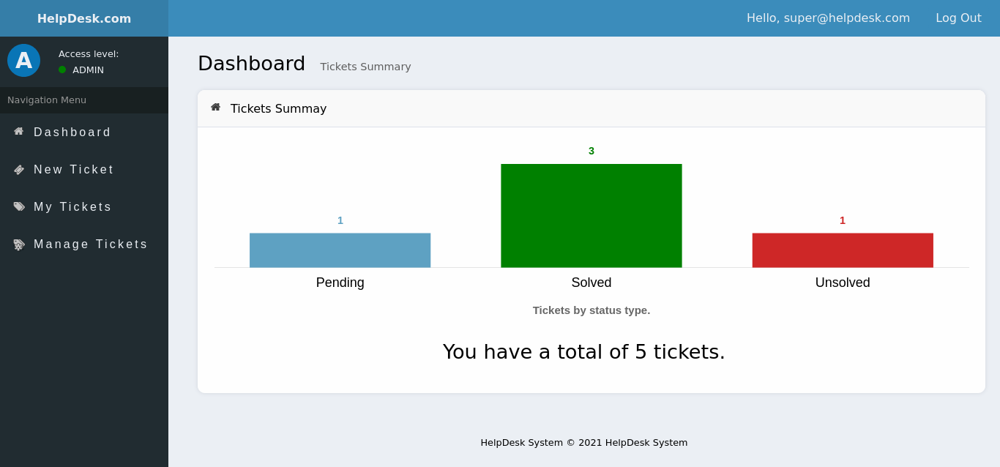
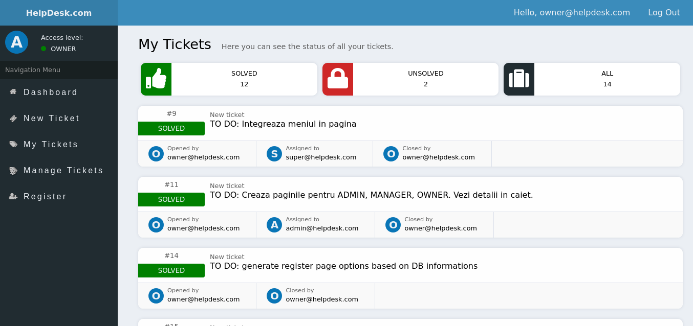

# Issue-Tracking-Application

Issue tracking application with ROLES:/
/
 - User - Can create new tickets./
 - Admin - Can solve tickets assigned by Manager or Owner/
 - Manager - Can assign tickets to Admins for their department/
 - Owner - Can delete tickets and add new users./
/

